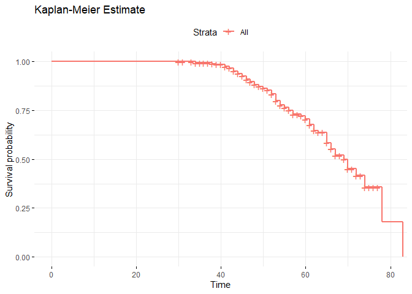
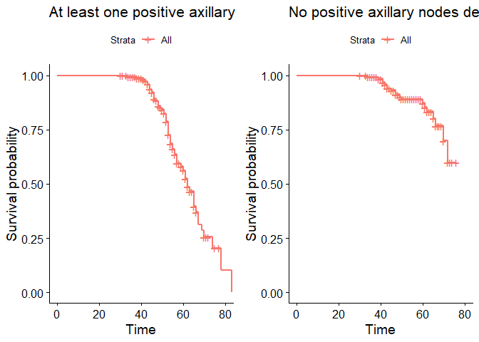
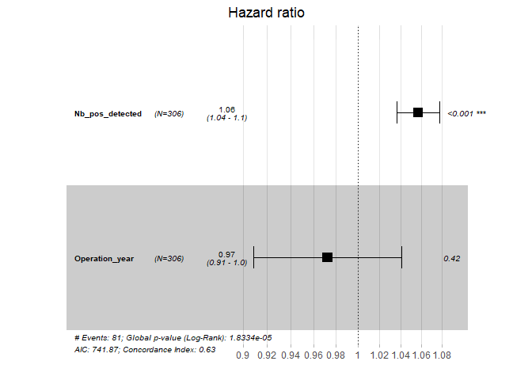

Cox Model Survival Analysis
================
Islam Asal
July 27, 2024

``` r
knitr::opts_chunk$set(fig.path='Figs/')
```

## Introduction

In this document, we will perform a survival analysis using a dataset
that contains information about patients, including their age, the year
of their operation, the number of positive axillary nodes detected, and
their survival status. We will implement both Kaplan-Meier estimation
and Cox Proportional Hazards modeling.

## Load Required Libraries

First, we load the necessary libraries that will be used throughout the
analysis. We are using `tidyverse` for data manipulation, `survival` and
`survminer` for survival analysis, `dlookr` for data profiling, and
`gridExtra` for arranging multiple plots.

``` r
library(tidyverse)
```

    ## Warning: package 'tidyverse' was built under R version 4.1.3

    ## Warning: package 'tibble' was built under R version 4.1.3

    ## Warning: package 'tidyr' was built under R version 4.1.3

    ## Warning: package 'readr' was built under R version 4.1.3

    ## Warning: package 'purrr' was built under R version 4.1.3

    ## Warning: package 'dplyr' was built under R version 4.1.3

    ## Warning: package 'forcats' was built under R version 4.1.3

    ## -- Attaching core tidyverse packages ------------------------ tidyverse 2.0.0 --
    ## v dplyr     1.1.2     v readr     2.1.4
    ## v forcats   1.0.0     v stringr   1.4.0
    ## v ggplot2   3.3.5     v tibble    3.2.1
    ## v lubridate 1.8.0     v tidyr     1.3.0
    ## v purrr     1.0.1     
    ## -- Conflicts ------------------------------------------ tidyverse_conflicts() --
    ## x dplyr::filter() masks stats::filter()
    ## x dplyr::lag()    masks stats::lag()
    ## i Use the conflicted package (<http://conflicted.r-lib.org/>) to force all conflicts to become errors

``` r
library(survival)
library(survminer)
```

    ## Warning: package 'survminer' was built under R version 4.1.3

    ## Loading required package: ggpubr
    ## 
    ## Attaching package: 'survminer'
    ## 
    ## The following object is masked from 'package:survival':
    ## 
    ##     myeloma

``` r
library(dlookr)
```

    ## Imported Arial Narrow fonts.
    ## 
    ## Attaching package: 'dlookr'
    ## 
    ## The following object is masked from 'package:tidyr':
    ## 
    ##     extract
    ## 
    ## The following object is masked from 'package:base':
    ## 
    ##     transform

``` r
library(gridExtra)
```

    ## 
    ## Attaching package: 'gridExtra'
    ## 
    ## The following object is masked from 'package:dplyr':
    ## 
    ##     combine

## Data Import and Preview

We read in the dataset using `read.csv()` and assign column names to
make the data easier to understand. Then, we take a quick look at the
first few rows using `head()` to get a sense of the data.

``` r
# Read in the data
data <- read.csv('data.csv', header = FALSE)
colnames(data) <- c('Age', 'Operation_year', 'Nb_pos_detected', 'Surv')

# Preview the data
head(data, 5)
```

    ##   Age Operation_year Nb_pos_detected Surv
    ## 1  30             64               1    1
    ## 2  30             62               3    1
    ## 3  30             65               0    1
    ## 4  31             59               2    1
    ## 5  31             65               4    1

## Data Profiling

Here, we use the `dlookr` package to diagnose the numeric variables in
the dataset. This provides a quick overview of the data, identifying any
potential issues such as missing values or outliers.

``` r
# Profiling report
diagnose_numeric
```

    ## function (.data, ...) 
    ## {
    ##     UseMethod("diagnose_numeric")
    ## }
    ## <bytecode: 0x000000002687cec0>
    ## <environment: namespace:dlookr>

``` r
# Profiling report
diagnose_numeric(data)
```

    ## # A tibble: 4 x 10
    ##   variables         min    Q1  mean median    Q3   max  zero minus outlier
    ##   <chr>           <int> <dbl> <dbl>  <dbl> <dbl> <int> <int> <int>   <int>
    ## 1 Age                30    44 52.5      52  60.8    83     0     0       0
    ## 2 Operation_year     58    60 62.9      63  65.8    69     0     0       0
    ## 3 Nb_pos_detected     0     0  4.03      1   4      52   136     0      40
    ## 4 Surv                1     1  1.26      1   2       2     0     0       0

The `diagnose_numeric()` function from the `dlookr` package helps in
generating diagnostic statistics for numeric variables, such as the
number of missing values, outliers, and summary statistics like the
mean, median, and standard deviation.

## Defining Time and Event Variables

In survival analysis, we need to define the time and event variables.
Here, `T` represents the time variable (in this case, age), and `E` is
the event indicator (whether or not the event, i.e., death, has
occurred).

``` r
# Define time and event variables
T <- data$Age
E <- data$Surv
```

The `Surv()` function in the `survival` package creates a survival
object using the time and event data, which will be used for modeling
later.

## Kaplan-Meier Estimator

The Kaplan-Meier estimator is a non-parametric statistic used to
estimate the survival function from lifetime data. Here, we fit a
Kaplan-Meier survival curve and visualize it.

``` r
# Kaplan-Meier Fitter
km_fit <- survfit(Surv(T, E) ~ 1, data = data)

# Plot the Kaplan-Meier curve
ggsurvplot(km_fit, data = data, conf.int = FALSE, ggtheme = theme_minimal(), title = "Kaplan-Meier Estimate")
```

<!-- -->

This code fits a Kaplan-Meier survival curve to the data and generates a
plot. The `ggsurvplot()` function from `survminer` provides an easy way
to create a well-structured survival plot.

## Stratified Kaplan-Meier Curves

Next, we create two cohorts based on the number of positive axillary
nodes detected: those with at least one positive node and those with no
positive nodes. We then plot separate Kaplan-Meier survival curves for
these two cohorts.

``` r
# Create cohorts based on the number of positive axillary nodes detected
groups <- data$Nb_pos_detected
i1 <- groups >= 1
i2 <- groups < 1

# Kaplan-Meier curve for cohort 1 (at least one positive axillary node detected)
km_fit1 <- survfit(Surv(T[i1], E[i1]) ~ 1, data = data[i1, ])
p1 <- ggsurvplot(km_fit1, data = data, conf.int = FALSE, title = "At least one positive axillary node detected")

# Kaplan-Meier curve for cohort 2 (no positive axillary nodes detected)
km_fit2 <- survfit(Surv(T[i2], E[i2]) ~ 1, data = data[i2, ])
p2 <- ggsurvplot(km_fit2, data = data, conf.int = FALSE, title = "No positive axillary nodes detected")
```

These Kaplan-Meier survival curves provide insights into the survival
probabilities for the two groups. The separation of the curves can
indicate differences in survival probabilities between the groups.

## Combining Plots

Using `grid.arrange()` from the `gridExtra` package, we can arrange
multiple plots side by side for easy comparison.

``` r
# Arrange both plots together
grid.arrange(p1$plot, p2$plot, ncol = 2)
```

<!-- -->

This code places the Kaplan-Meier plots for the two cohorts side by side
for a clear visual comparison.

## Cox Proportional Hazards Model

The Cox Proportional Hazards model is a semi-parametric model used to
assess the effect of several variables on survival time. Here, we fit a
Cox model to the data.

``` r
# Cox Proportional Hazards Model
cph_fit <- coxph(Surv(Age, Surv) ~ Nb_pos_detected + Operation_year, data = data)

# Summary of the Cox model
summary(cph_fit)
```

    ## Call:
    ## coxph(formula = Surv(Age, Surv) ~ Nb_pos_detected + Operation_year, 
    ##     data = data)
    ## 
    ##   n= 306, number of events= 81 
    ## 
    ##                     coef exp(coef) se(coef)      z Pr(>|z|)    
    ## Nb_pos_detected  0.05517   1.05672  0.01009  5.469 4.52e-08 ***
    ## Operation_year  -0.02801   0.97238  0.03474 -0.806     0.42    
    ## ---
    ## Signif. codes:  0 '***' 0.001 '**' 0.01 '*' 0.05 '.' 0.1 ' ' 1
    ## 
    ##                 exp(coef) exp(-coef) lower .95 upper .95
    ## Nb_pos_detected    1.0567     0.9463    1.0360     1.078
    ## Operation_year     0.9724     1.0284    0.9084     1.041
    ## 
    ## Concordance= 0.631  (se = 0.041 )
    ## Likelihood ratio test= 21.81  on 2 df,   p=2e-05
    ## Wald test            = 30.08  on 2 df,   p=3e-07
    ## Score (logrank) test = 32.88  on 2 df,   p=7e-08

The summary of the Cox model provides important information, such as
hazard ratios for the predictor variables and their statistical
significance.

## Visualizing Cox Model Coefficients

We can visualize the coefficients from the Cox model using the
`ggforest()` function from the `survminer` package.

``` r
# Plot the Cox model coefficients
ggforest(cph_fit, data = data)
```

<!-- -->

This forest plot provides a graphical representation of the hazard
ratios and their confidence intervals for the variables in the Cox
model. It allows for an easier interpretation of the impact of each
variable on survival.

## Predicting Survival Curves for Specific Patients

Finally, we predict survival curves for a subset of patients and plot
them. This is useful for visualizing individual survival probabilities
over time.

``` r
# Predict survival curves for specific patients
patients <- c(8, 155, 288)
selected_patients <- data[patients, c('Nb_pos_detected', 'Operation_year')]

# Predict and plot survival curves for selected patients
surv_curves <- survfit(cph_fit, newdata = selected_patients)
ggsurvplot(surv_curves, data = data, ggtheme = theme_minimal(), title = "Survival Curves for Selected Patients")
```

    ## Warning: `gather_()` was deprecated in tidyr 1.2.0.
    ## i Please use `gather()` instead.
    ## i The deprecated feature was likely used in the survminer package.
    ##   Please report the issue at <https://github.com/kassambara/survminer/issues>.
    ## This warning is displayed once every 8 hours.
    ## Call `lifecycle::last_lifecycle_warnings()` to see where this warning was
    ## generated.

<!-- -->

The predicted survival curves for specific patients provide a
patient-level visualization of survival probabilities. These curves help
in understanding how different factors influence the survival
probabilities of individual patients.

## Conclusion

In this analysis, we performed survival analysis using Kaplan-Meier
estimation and the Cox Proportional Hazards model. We explored the
survival probabilities for different cohorts and predicted survival
curves for specific patients. This type of analysis is crucial for
understanding the impact of various factors on patient survival in
medical research.

\`\`\`
